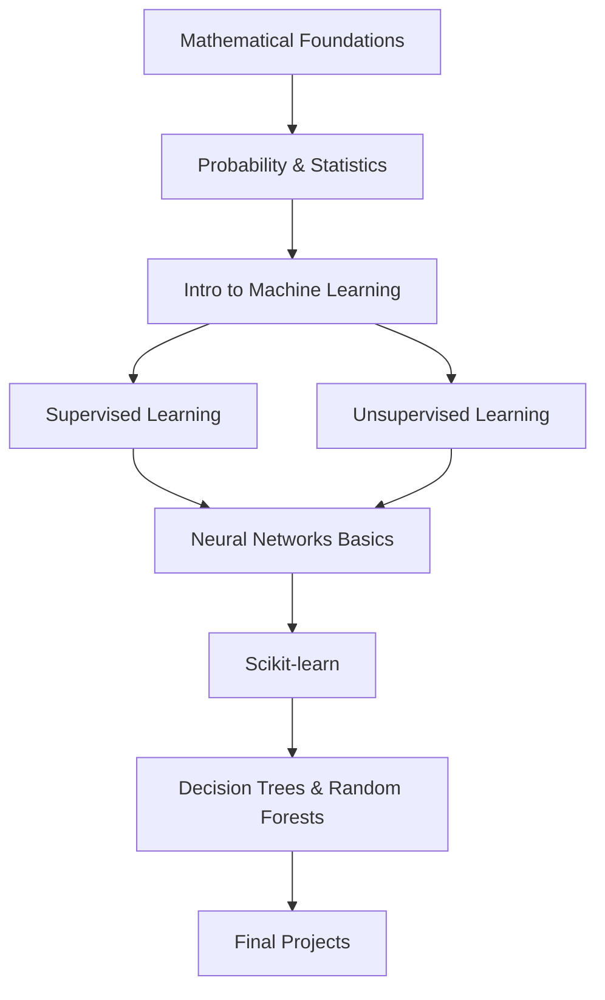

# 🤖 AI Theory: From Basics to Advanced Machine Learning

## 📚 Course Overview

Welcome to this comprehensive AI theory training repository! This course is designed to take you from fundamental mathematical concepts to advanced machine learning techniques, culminating in practical applications using scikit-learn and Random Forests.


## 🎯 Learning Objectives

By the end of this course, you will:
- ✅ Master the mathematical foundations of AI (Linear Algebra, Probability, Statistics)
- ✅ Understand core machine learning concepts and algorithms
- ✅ Learn supervised and unsupervised learning techniques
- ✅ Gain hands-on experience with scikit-learn
- ✅ Master Decision Trees and Random Forests
- ✅ Build real-world machine learning projects

## 📖 Course Structure

### **Foundation Modules**

#### 📐 [Module 1: Mathematical Foundations - Linear Algebra](modules/01_linear_algebra.md)
- Vectors and Matrices
- Matrix Operations
- Eigenvalues and Eigenvectors
- Principal Component Analysis (PCA) Foundation
- **Duration**: 2-3 weeks
- **Prerequisites**: Basic algebra

#### 📊 [Module 2: Probability and Statistics](modules/02_probability_statistics.md)
- Probability Theory Fundamentals
- Distributions (Normal, Binomial, Poisson)
- Bayes' Theorem
- Statistical Inference
- Hypothesis Testing
- **Duration**: 2-3 weeks
- **Prerequisites**: Module 1

### **Core Machine Learning**

#### 🧠 [Module 3: Introduction to Machine Learning](modules/03_intro_to_ml.md)
- What is Machine Learning?
- Types of Learning (Supervised, Unsupervised, Reinforcement)
- The Machine Learning Pipeline
- Model Evaluation Metrics
- Overfitting and Underfitting
- **Duration**: 1-2 weeks
- **Prerequisites**: Modules 1-2

#### 📈 [Module 4: Supervised Learning Fundamentals](modules/04_supervised_learning.md)
- Linear Regression
- Logistic Regression
- Gradient Descent
- Regularization (L1/L2)
- Cross-Validation
- **Duration**: 3-4 weeks
- **Prerequisites**: Module 3

#### 🔍 [Module 5: Unsupervised Learning](modules/05_unsupervised_learning.md)
- K-Means Clustering
- Hierarchical Clustering
- DBSCAN
- Dimensionality Reduction (PCA, t-SNE)
- **Duration**: 2-3 weeks
- **Prerequisites**: Module 4

### **Advanced Topics**

#### 🔗 [Module 6: Neural Networks and Deep Learning Basics](modules/06_neural_networks.md)
- Perceptron Model
- Multi-Layer Perceptrons
- Backpropagation
- Activation Functions
- Introduction to Deep Learning
- **Duration**: 3-4 weeks
- **Prerequisites**: Modules 1-5

### **Practical Implementation**

#### 🛠️ [Module 7: Scikit-learn - A Practical Introduction](modules/07_scikit_learn.md)
- Setting up the Environment
- Data Preprocessing with scikit-learn
- Model Training and Evaluation
- Pipeline Creation
- Model Persistence
- **Duration**: 2-3 weeks
- **Prerequisites**: Modules 1-6

#### 🌲 [Module 8: Decision Trees and Random Forests](modules/08_decision_trees_random_forests.md)
- Decision Tree Algorithm
- Information Gain and Gini Index
- Tree Pruning
- Ensemble Methods
- Random Forests in Detail
- Feature Importance
- Hyperparameter Tuning
- **Duration**: 3-4 weeks
- **Prerequisites**: Module 7

## 🚀 Getting Started

### Prerequisites
- **Mathematics**: High school level algebra
- **Programming**: Basic Python knowledge (recommended)
- **Time Commitment**: ~3-4 hours per week
- **Tools**: Python 3.8+, Jupyter Notebooks, scikit-learn

### Installation Guide

```bash
# Clone this repository
git clone https://github.com/yourusername/ai-theory.git
cd ai-theory

# Create a virtual environment
python -m venv venv
source venv/bin/activate  # On Windows: venv\Scripts\activate

# Install required packages
pip install -r requirements.txt
```

### How to Use This Repository

1. **Sequential Learning**: Follow modules in order for best results
2. **Practice Exercises**: Complete exercises at the end of each module
3. **Code Examples**: Run all code examples in the `examples/` directory
4. **Projects**: Build the capstone projects to solidify understanding
5. **Discussion**: Use Issues for questions and discussions

## 📂 Repository Structure

```
ai-theory/
│
├── README.md                 # This file
├── requirements.txt          # Python dependencies
│
├── modules/                  # Course modules
│   ├── 01_linear_algebra.md
│   ├── 02_probability_statistics.md
│   ├── 03_intro_to_ml.md
│   ├── 04_supervised_learning.md
│   ├── 05_unsupervised_learning.md
│   ├── 06_neural_networks.md
│   ├── 07_scikit_learn.md
│   └── 08_decision_trees_random_forests.md
│
├── exercises/                # Practice problems
│   ├── module_01/
│   ├── module_02/
│   └── ...
│
├── examples/                 # Code examples
│   ├── linear_algebra/
│   ├── probability/
│   └── ...
│
├── projects/                 # Capstone projects
│   ├── project_1_regression/
│   ├── project_2_classification/
│   └── project_3_random_forest/
│
└── resources/               # Additional resources
    ├── datasets/
    ├── cheatsheets/
    └── references.md
```

## 💡 Learning Path Visualization



## 📚 Additional Resources

### Recommended Books
- 📖 "Pattern Recognition and Machine Learning" by Christopher Bishop
- 📖 "The Elements of Statistical Learning" by Hastie, Tibshirani, and Friedman
- 📖 "Machine Learning" by Tom Mitchell
- 📖 "Hands-On Machine Learning" by Aurélien Géron

### Online Resources
- 🌐 [Andrew Ng's Machine Learning Course](https://www.coursera.org/learn/machine-learning)
- 🌐 [Fast.ai Practical Deep Learning](https://www.fast.ai/)
- 🌐 [Google's Machine Learning Crash Course](https://developers.google.com/machine-learning/crash-course)
- 🌐 [Scikit-learn Official Documentation](https://scikit-learn.org/)

### Visual Learning Resources
- 🎥 [3Blue1Brown - Neural Networks](https://www.youtube.com/watch?v=aircAruvnKk)
- 🎥 [StatQuest with Josh Starmer](https://www.youtube.com/user/joshstarmer)
- 🎥 [Two Minute Papers](https://www.youtube.com/user/keeroyz)

---

## 🚦 Quick Navigation

| Module | Topic | Difficulty | Estimated Time |
|--------|-------|------------|----------------|
| [1](modules/01_linear_algebra.md) | Linear Algebra | ⭐⭐ | 2-3 weeks |
| [2](modules/02_probability_statistics.md) | Probability & Statistics | ⭐⭐ | 2-3 weeks |
| [3](modules/03_intro_to_ml.md) | Intro to ML | ⭐ | 1-2 weeks |
| [4](modules/04_supervised_learning.md) | Supervised Learning | ⭐⭐⭐ | 3-4 weeks |
| [5](modules/05_unsupervised_learning.md) | Unsupervised Learning | ⭐⭐⭐ | 2-3 weeks |
| [6](modules/06_neural_networks.md) | Neural Networks | ⭐⭐⭐⭐ | 3-4 weeks |
| [7](modules/07_scikit_learn.md) | Scikit-learn | ⭐⭐ | 2-3 weeks |
| [8](modules/08_decision_trees_random_forests.md) | Decision Trees & RF | ⭐⭐⭐ | 3-4 weeks |

---
